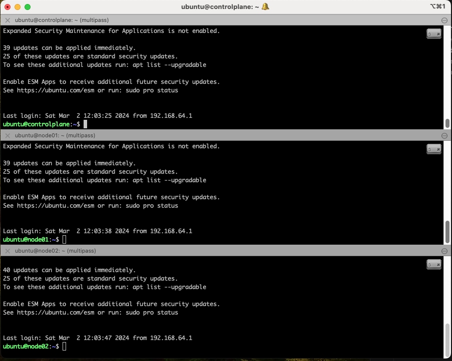

# Prerequisites

* Apple Silicon System (M1/M2/M3 etc)
* VMware Fusion
* Vagrant and the Vagrant VMware provider
* 8GB RAM (16GB preferred).

**Install Vagrant**

Go to the [download page](https://developer.hashicorp.com/vagrant/downloads)

If you have [homebrew](https://brew.sh/) installed (you really should :smile:), follow the **Package manager** instructions, *else* download the ARM64 version for macOS which will download a DMG package which Finder can install for you.

**Install VMware Fusion**

This is quite fiddly due to the fact that the Broadcom site is like a maze (Broadcom acquired VMware at the end of 2023). They keep moving it around therefore it is not practical to have specific instructions here, however the general gist is -

1. Start at https://www.vmware.com/products/desktop-hypervisor/workstation-and-fusion
1. Select Download Fusion or Workstation - you will be redirected to a login page.
1. Register for a new account.
1. Once your account is activated, then find your way to the Fusion Pro download page.
1. Download it and Finder will install it for you

**Install the Vagrant provider for VMware**

* Follow the instructions [here](https://developer.hashicorp.com/vagrant/docs/providers/vmware/installation).

## Virtual Machine Network

TO VERIFY

### Bridge Networking

The default configuration in this lab is to bring the VMs up on bridged interfaces. What this means is that your Kubernetes nodes will appear as additional machines on your local network, their IP addresses being provided dynamically by your broadband router. This facilitates the use of your browser to connect to any NodePort services you deploy.

Should you have issues deploying bridge networking, please raise a [bug report](https://github.com/kodekloudhub/certified-kubernetes-administrator-course/issues) and include all details including the output of `vagrant up`.

Then retry the lab in NAT mode. How to do this is covered in the [next section](../../vagrant/docs/02-compute-resources.md).

### NAT Networking

In NAT configuration, the network on which the VMs run is isolated from your broadband router's network by a NAT gateway managed by the hypervisor. This means that VMs can see out (and connect to Internet), but you can't see in (i.e. use browser to connect to NodePorts) without setting up individual port forwarding rules for every NodePort using Fusion command line tools.

The network used by the VMware virtual machines is `192.168.56.0/24`.

To change this, edit the [Vagrantfile](../Vagrantfile) in your cloned copy (do not edit directly in github), and set the new value for the network prefix at line 17. This should not overlap any of the other network settings.

Note that you do not need to edit any of the other scripts to make the above change. It is all managed by shell variable computations based on the assigned VM  IP  addresses and the values in the hosts file (also computed).

It is *recommended* that you leave the pod and service networks as the defaults. If you change them then you will also need to edit the Weave networking manifests to accommodate your change.

If you do decide to change any of these, please treat as personal preference and do not raise a pull request.

## Running Commands in Parallel with iterm2

[iterm2](https://iterm2.com/) which is a popular replacement for the standard Mac terminal application can be used to run the same commands on multiple compute instances at the same time. Some labs in this tutorial require running the same commands on multiple compute instances for instance installing the Kubernetes software. In those cases you may consider using iterm2 and splitting a window into multiple panes with *Broadcast input to all panes* enabled to speed up the provisioning process.

*The use of iterm2 is optional and not required to complete this tutorial*.

To set up as per the image above, do the following in iterm2
1. Right click and select split pane horizontally
1. Do this again to create the third pane (if building 2 workers)
1. In each pane, connect to a different node with `vagrant ssh`
1. From the `Session` menu at the top, select `Broadcast` -> `Broadcast input to all panes`. The small icon at the top right of each pane indicates broadcast mode is enabled.

Input typed or passed to one command prompt will be echoed to the others. Remember to turn off broadcast when you have finished a section that applies to all nodes.

Next: [Compute Resources](../../vagrant/docs/02-compute-resources.md)

